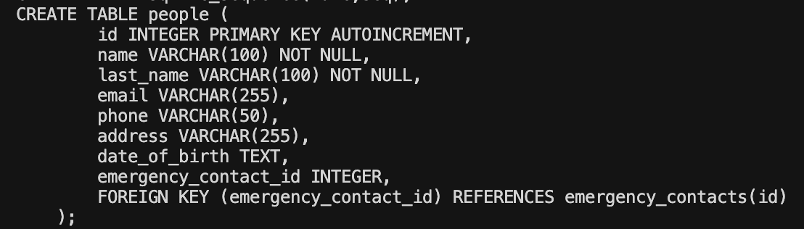
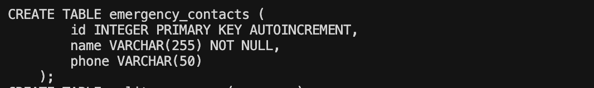
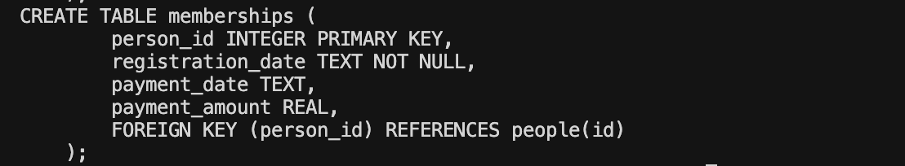

# Web services and Applications: Final project 

Final project for the course "Web services and applications", Higher Diploma in Computing for Data Analytics, ATU Galway Mayo, 2025-2026. 

The project is a REST API and web application created for the admins of the sports association Slackline Ireland to manage member registrations, subscriptions and emergency contacts. 

## The project: Slackline Ireland memberships 

In my daily worklife I have access and use LLMs and AI agents extensively. However, for security reasons, it wasn't possible for me to use any of my work projects for this course. So I decided to take inspiratipn from  my hobbies and created an application to manage the members of the Slackline community in Dublin. 

What is slackline? Basically, it's about walking on a loose rope (or slackline). You can do it in the park, in the forest, in the mountains. 
Slackline Ireland is an informal, self-regulated organization. We meet up in the park, go on adventures around Ireland, share knowledge and best practices, and above all have fun wiggling above the ground. 

Joining the group and being a member is free, but we want to keep track of regular attendees, know about emergency contacts, and track contributions to access indoor activities and shared equipment. 

  

## Getting started 

Programming languages used:

- SQL (the database)
- Python (for back end)
- Javascript, CSS, HTML (for the front end)

### Local application

To run the code locally, clone the repository and install the required dependencies: 

    pip install -r requirements.txt 
 

Start the Flask app: 

    python server.py

To perform CRUD operations using the UI, open this url with your browser:

    http://127.0.0.1:5000

To make curl requests from your terminal,  use the routes described in section **2. Flask app and person DAO**, adding to the Headers the parameter *Accept: application/json*.  

View a member by id: 

    curl -H "Accept: application/json" http://127.0.0.1:5000/person/1

Create a new member: 

    curl -X POST http://127.0.0.1:5000/form \
    -H "Content-Type: application/json" \
    -d '{
        "name": "John",
        "last_name": "Doe",
        "phone": "0712345678",
        "email": "john.doe@example.com",
        "emergency_contact_name": "Jane Doe",
        "emergency_contact_phone": "0787654321"
    }'

For more information on curl requests, visit [curl.se](https://curl.se/docs/httpscripting.html) or type the command: 

    curl --help

### Hosted application

The code required to run the Flask App was imported to [eu.pythonanywhere.com](eu.pythonanywhere.com) and is now always available without running the code locally. 

The application is available at [https://celebrin.eu.pythonanywhere.com/](https://celebrin.eu.pythonanywhere.com/). 

It is also possible to make curl requests to the hosted application using the same format displayed above and replacing the url. 

## The implementation 

### 1. Database 

**Database creation**  

The database is created parsing the data from the existing csv [db_anonymised.csv](project/data/db_anonymised.csv) and importing it into a relational database using SQLite: [slackline.db](data/slackline.db). The real data from Slackline Ireland was anonymised to respect the privacy of its members. 

*Why SQLite?* It was chosen because the amount of data to handle was not significant, and for its portability (no installation required, ready-to-use in all operating systems, once Python is installed, and easy to host). 

The script used to parse the data is [import_data.py](import_data.py). 

**Database structure**

The database is created using the script [create_database.py](create_database.py). The program defines 3 tables: 

- **People**: the main table with the list of members, contacts and addresses. It includes 1 foreign key linking to the table *emergency contacts*. 

  

- **Emergency contacts**: name and numbers of emergency contacts for every member.  

  

- **Memberships**: it includes data like registration dates and payments (note: paying a contribution is not required, any member can choose to do it to fund the organization and access extra activities). A foreign key is used to reference the table *peeople*. 

  

How to use SQLite: [sqllite.org](https://sqlite.org/), [sqlite3 on python](https://docs.python.org/3/library/sqlite3.html). 

### 2. Flask app and Person DAO

In [server.py](server.py), a Flask app is created to serve both the HTML front end and a JSON API, allowing CRUD functionalities on the database [slackline.db](data/slackline.db).

Each route serves two purposes in delivering content: browser requests receive the corresponding HTML page, and curl requests with the flag `Accept: application/json` in the Headers receive JSON data. This means that requests can be made either from terminal (to get JSON responses) or from the web application. 

| Route | Methods | Description |
|---|---|---|
| `/persons` | GET | Members list page / JSON list of all members |
| `/persons/surname/<value>` | GET | Members list filtered by surname (case-insensitive) |
| `/persons/email/<value>` | GET | Members list filtered by email (case-insensitive) |
| `/person/<id>` | GET | Member detail page / JSON for a single member |
| `/person/<id>` | PUT | Partially update a member by ID (JSON body) |
| `/person/<id>` | DELETE | Delete a member by ID |
| `/form` | GET | Add / edit member page |
| `/form` | POST | Create a new member (JSON body); returns 201 on success |
| `/` | n/a |  Static index |
| `/gallery/<path:filename>` |  n/a |   Gallery |

**Required fields for creation (POST /form):** `name`, `last_name`, `phone`, `email`, `emergency_contact_name`, `emergency_contact_phone`.

All write operations return 404 if the member is not found. DELETE returns `{"deleted": id}` on success; deleting a member results in deleting all the member details across the database (this is implemented in the code, not in the database). 

The **person DAO** includes the functions to connect to the database and perform the CRUD operations mapped in the Flask APP. 

### 3. Front End 

The front end is a set of HTML pages served directly by the Flask app, styled with a single [CSS file](`FE/static/style.css`). 

Every page shares a **navigation bar** that includes a smart search field: 

- if the query contains `@`, the app searches by email; 
- otherwise it searches by surname. 

**Landing Page**: [Index.html](FE/templates/index.html) displays a hero image, organisation contact details, and links to the rest of the app. 

**Members list**:  [members.html](FE/templates/members.html) fetches all members from the API and renders them in a table, with each row linking to the corresponding detail page. 

**Member detail**: [member.html](FE/templates/member.html) shows personal information, emergency contact, and membership/payment data, together with Edit and Delete buttons (linked to the update/delete routes). 

**Form page**: [form.html](FE/templates/form.html) handles both new-member creation and editing of existing members: when a member ID is passed as a query parameter (`?id=`), the form pre-fills with the current data and submits a PUT request; otherwise it submits a POST to create a new member.

## AI usage 

This project was created with extensive use of AI. The AI Agent used was Claude-4.6-sonnet, through [Cursor](https://cursor.com/). Cursor is an IDE that allows to integrate AI assistants in your workflow. For this reason, I was not able to produce links as reference. 

However, this is how the project was implemented: 

- The SQL lite database was designed and implemented by me.
- I created the Flask app and the person DAO to support json reponses (no web UI). 

AI helped with: 

- Modifying the Flask App and the person DAO to support the double function of json responses / web application. 
- Creating Front End from scratch. 

This still required significant prompting to follow the design I had in mind and avoid redundancies. My design included: 

- Mapping: All routes support two functions, the web app and the json responses, rather than having separate routes. 
- Front End: The colors, images and view options and search functionalities.  

