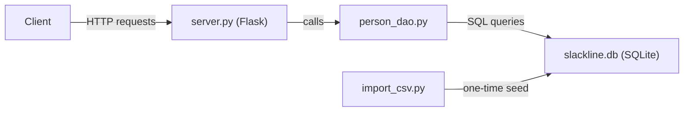

# Slackline Ireland REST API -- Implementation Plan

## Current State

You already have:
- **[server.py](project/server.py)** -- Flask app with route stubs (no real logic yet)
- **[person_dao.py](project/person_dao.py)** -- DAO with placeholder functions returning dummy values
- **[db.csv](project/db.csv)** -- 17 real member records to import
- **[requirements.txt](project/requirements.txt)** -- Flask and its dependencies

## Architecture



## Step 1: Database Setup (SQLite)

SQLite is the right choice here -- zero configuration, single file, and fully sufficient for this scale. No need for MySQL.

Create a file **`project/create_database.py`** that:
- Creates `slackline.db` with three tables matching your schema:

```sql
CREATE TABLE IF NOT EXISTS emergency_contacts (
    id INTEGER PRIMARY KEY AUTOINCREMENT,
    name VARCHAR(255) NOT NULL,
    phone VARCHAR(50)
);

CREATE TABLE IF NOT EXISTS people (
    id INTEGER PRIMARY KEY AUTOINCREMENT,
    name VARCHAR(100) NOT NULL,
    last_name VARCHAR(100) NOT NULL,
    email VARCHAR(255),
    phone VARCHAR(50),
    address VARCHAR(255),
    date_of_birth TEXT,
    emergency_contact_id INTEGER,
    FOREIGN KEY (emergency_contact_id) REFERENCES emergency_contacts(id)
);

CREATE TABLE IF NOT EXISTS memberships (
    id INTEGER PRIMARY KEY AUTOINCREMENT,
    person_id INTEGER NOT NULL,
    registration_date TEXT NOT NULL,
    payment_date TEXT,
    payment_amount REAL,
    FOREIGN KEY (person_id) REFERENCES people(id)
);
```

**Schema notes vs. your design doc:**
- `phone` fields use `VARCHAR` instead of `number` since phone numbers contain `+`, spaces, and leading zeros
- `date_of_birth` is added to `people` (present in CSV but missing from your original schema)
- `memberships.person_id` is a foreign key back to `people`, rather than the other way around -- this is more normalized since a person can have multiple memberships over time
- Dates stored as ISO 8601 text (`YYYY-MM-DD`), which is SQLite best practice

## Step 2: CSV Import Script

Create **`project/import_csv.py`** to seed the database from `db.csv`:
- Parse each CSV row
- Insert an emergency contact row, capture the new ID
- Insert a person row referencing that emergency contact ID
- Insert a membership row with the registration date from CSV (payment fields left null for now)
- Handle date format conversion from `DD/MM/YYYY` to `YYYY-MM-DD`
- Handle edge cases in the data (extra whitespace in names, missing addresses, the row where emergency contact name/phone are swapped)

## Step 3: Implement the DAO ([person_dao.py](project/person_dao.py))

Replace the stubs with real SQLite queries. The DAO should use Python's built-in `sqlite3` module (no extra dependencies needed).

Functions to implement:

| Function | SQL | Notes |
|---|---|---|
| `get_all()` | `SELECT` with `JOIN` across all 3 tables | Returns list of dicts |
| `get_by_id(id)` | Same join, `WHERE people.id = ?` | Returns single dict or None |
| `search(query)` | `WHERE last_name LIKE ? OR email LIKE ?` | New function for search by surname/email |
| `create(person)` | `INSERT` into emergency_contacts, then people, then memberships | Transactional |
| `update(id, person)` | `UPDATE` relevant tables | Only updates provided fields |
| `delete(id)` | `DELETE` from people + cascading deletes | Also removes linked emergency contact and memberships |

Each function should:
- Open/close a connection (or use a helper)
- Use parameterized queries (never string interpolation) to prevent SQL injection
- Return dictionaries (not tuples) by setting `row_factory = sqlite3.Row`

## Step 4: Wire Up Flask Routes ([server.py](project/server.py))

Update the existing routes to call the real DAO functions and handle errors:

- **GET `/members`** -- return `get_all()` as JSON (consider renaming from `/persons` to `/members` to match the domain)
- **GET `/members/<int:id>`** -- return member or 404
- **GET `/members/search?q=...`** -- search by surname or email
- **POST `/members`** -- validate required fields (name, surname, phone, email, emergency contact name, emergency contact number), create member, return 201
- **PUT `/members/<int:id>`** -- partial update, auto-set `payment_date` to today when `payment_amount` is updated
- **DELETE `/members/<int:id>`** -- delete member, return 200 or 404

Add proper HTTP status codes and error handling (`400` for bad input, `404` for not found, `500` for server errors).

## Step 5: Update Dependencies

Add `sqlite3` usage requires no new packages (it's in Python's standard library). The current `requirements.txt` is sufficient.

Optionally add to `.gitignore`:
```
*.db
```
so the SQLite database file isn't committed.

## Out of Scope (for now, per your design doc)
- Front-end (Step 3 in your plan)
- Hosting on PythonAnywhere (Step 4)
- Backup / Google Sheets sync
- Authentication / admin vs. member roles
